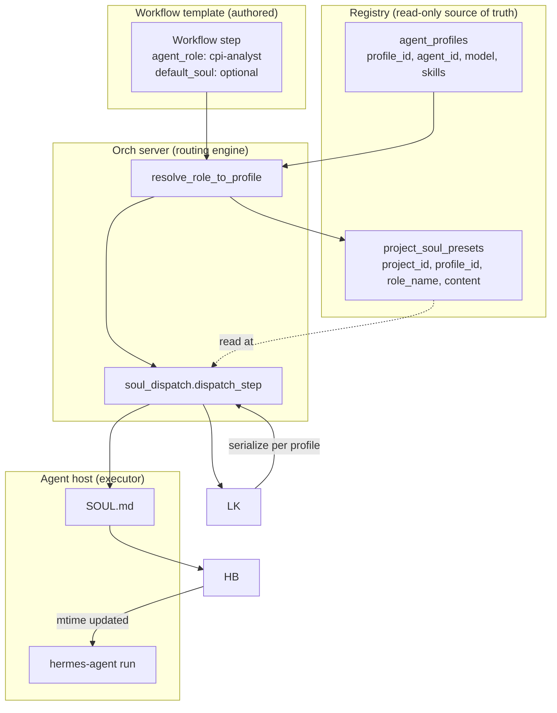

# SOUL Routing & Dispatch Design

**Status:** design (locked 2026-08-01, ready for Phase 1 implementation)
**Target release:** v3.9.0
**Author:** Mavis (with user)

## TL;DR

Decouple **profile** (a registered capability resource) from **role** (a
project-context label assigned by the orch server at dispatch time). The
orch server routes workflow steps to profiles, then writes a **clean,
unambiguous SOUL** to the target profile's `SOUL.md` before each task —
serialized per-profile via the existing `profile_configs` claim→ack flow,
so concurrent projects on the same fleet never clobber each other.

This is the central architectural change for v3.9.0. Everything else
(LLM planner context, project-level override UI, workflow authoring) is
built on top of this contract.

## Context

### The problem we're solving

Today's flow lets a user set a SOUL on a project × profile, then expects
the dispatch path to "just work". In practice:

- **User-managed SOULs are footguns.** A bad SOUL + a bad task match =
  worse output than no SOUL at all.
- **Project-scoped SOUL creates race conditions.** Project A and B both
  targeting `linux-a-01/super` clobber each other's `SOUL.md`.
- **The dispatch path is implicit.** The orch server has no central
  place to decide "this step needs profile X, with role Y, persona Z".
  Today the user wires this up by hand; tomorrow the workflow can't be
  moved between fleets.

### Why "the user shouldn't manage this"

The orch server's job is to **own the mapping from intent to
execution**. A registered profile is a capability resource (skills,
model, location) — like a CPU with a feature set. The role is what the
project calls that resource *for this run*, like a process name. Locking
the role at registration time (a common pattern in AutoGen / CrewAI)
forces every project to share the same persona on the same profile,
which is wrong for productized workflows where one project is a CPI
analysis and the next is a code review.

### Differentiation

Other AI team products lock role at agent creation, or use static role
assignment:

| Product | Role model | Per-project reassignment | Per-task SOUL |
|---|---|---|---|
| AutoGen | Fixed at agent creation | No | No |
| CrewAI | Role + goal + backstory, fixed | No | No |
| LangGraph | No role concept | N/A | N/A |
| MetaGPT | Profile at registration | No | No |
| ChatDev | Role = agent class | No | No |
| **hermes-orch v3.9.0** | **Capability only at registration; role + SOUL assigned per project by orch server** | **Yes** | **Yes** |

The key differentiator: **the orch server is the central router and
SOUL owner**, not the user. This unlocks the workflow-as-moat thesis —
a workflow author defines the role contract once, and the orch server
binds it to whatever fleet is available at run time.

## Goals

1. **Single source of truth for SOUL state.** Orch server tracks which
   `SOUL.md` is on which profile, when it was applied, by which project.
2. **No SOUL clobbering.** Concurrent projects on the same fleet never
   overwrite each other.
3. **Workflow-defined role contract.** A workflow step declares the
   `agent_role` (and optional `default_soul`); the orch server resolves
   it to a profile at dispatch.
4. **Predictable dispatch latency.** No "wait 5s and hope" — heartbeat
   confirmation before sending the task.
5. **Backward compatible.** Existing projects without profiles or with
   hand-rolled SOUL.md keep working (lazy migration via warning).

## Non-goals

- **No LLM-driven role assignment** at dispatch. Routing is deterministic
  (capability match or workflow hint). LLM is reserved for plan
  generation, not per-task routing decisions.
- **No project-level SOUL editor in the default UI.** The "SOUL presets"
  section on the project page becomes read-only by default; advanced
  override is opt-in (Phase 2).
- **No mid-run SOUL changes propagate to in-flight tasks.** Tasks carry
  a SOUL snapshot in their payload; live `SOUL.md` can drift but the
  task won't see the drift.
- **No cross-process distributed locks.** The orch server is
  single-process for now; the existing `profile_configs` flow already
  serializes per-profile via the atomic UPDATE in `claim_pending_config`
  (`api/agents.py:1229-1237`). If we ever go multi-process, the lock
  primitives need to be re-evaluated (Phase 4+).

## Architecture



Three components:

1. **Registry** (`agent_profiles` + `project_soul_presets`) — what's
   available, what's bound.
2. **Routing engine** (`orchestrator/routing.py`) — picks the profile
   for a step.
3. **SOUL dispatch** (`orchestrator/soul_dispatch.py`) — applies the
   SOUL cleanly before sending the task.

## Data model

### `agent_profiles` (existing, minor change)

| Column | Type | Notes |
|---|---|---|
| `id` | TEXT PK | unchanged |
| `agent_id` | TEXT | unchanged (which host) |
| `model` | TEXT | unchanged |
| `provider` | TEXT | unchanged |
| `skills` | TEXT | **NEW** — JSON list of capability tags (e.g. `["web_search", "python", "write_file"]`) |
| `description` | TEXT | unchanged |
| ❌ `role` | — | **NOT added** — role is contextual, not a column |

The `skills` column is a list of strings. The routing engine does a
substring/exact match against workflow step's `required_capabilities`
field. Taxonomy is loose (no formal ontology); the workflow author
matches strings.

### `project_soul_presets` (existing, semantic shift)

| Column | Type | Notes |
|---|---|---|
| `id` | TEXT PK | unchanged |
| `project_id` | TEXT FK | unchanged |
| `profile_id` | TEXT FK | unchanged |
| `role_name` | TEXT | unchanged (display label for this binding) |
| `content` | TEXT | unchanged (the SOUL text) |
| `created_at` | TIMESTAMP | unchanged |
| `updated_at` | TIMESTAMP | unchanged |
| `default_soul` | TEXT | **NEW** — workflow-supplied default; orch server uses this as the initial content if `content` is empty |
| `last_applied_at` | TIMESTAMP | **NEW** — when orch last wrote this preset to a host's `SOUL.md` |
| `last_applied_mtime` | TEXT | **NEW** — host-side `SOUL.md` mtime after apply (for verification) |

Semantic shift: this table is now **orch-server-managed by default**.
The existing user-edit UI stays as an "advanced override" toggle in
Phase 2 (default OFF).

### `workflow_steps` (existing, minor additions in the visual editor)

The plan editor's step already has `agent_role` (string). Additions:

| Field | Type | Notes |
|---|---|---|
| `agent_role` | string | unchanged (e.g. `"cpi-analyst"`) |
| `default_soul` | string | **NEW** — workflow author's persona; orch server uses if project preset has no override |
| `target_profiles` | string[] | **NEW, optional** — workflow author's hint pool; orch server restricts routing to this set |

The visual plan editor gets two new optional fields per step. They are
advisory (the orch server can fall back to capability match if the
profile pool is empty/unavailable).

## Algorithm: hybrid routing

```python
async def resolve_role_to_profile(
    project_id: str, step: PlanStep,
) -> Profile:
    """Pick the best profile for `step` in this project.

    Strategy order:
      1. Workflow hint pool (step.target_profiles), if non-empty
      2. Project preset binding (project_soul_presets.role_name == step.agent_role)
      3. Capability match (profile.skills ⊇ step.required_capabilities)
      4. Fail with 422 + actionable error
    """

    # 1. Workflow hint pool
    if step.target_profiles:
        for pid in step.target_profiles:
            if await _is_profile_idle_and_online(pid):
                return await get_profile(pid)
        # Hint pool exhausted; fall through to capability match

    # 2. Project preset binding (per-project, may not exist yet)
    preset = await db.get_soul_preset_by_role(project_id, step.agent_role)
    if preset and await _is_profile_idle_and_online(preset.profile_id):
        return await get_profile(preset.profile_id)

    # 3. Capability match — find any idle profile whose skills
    #    cover step.required_capabilities
    for p in await _list_online_profiles():
        if not _is_profile_idle(p.id): continue
        if _skills_cover(p.skills, step.required_capabilities):
            return p

    # 4. No match — return error
    raise NoProfileAvailable(
        project_id=project_id,
        role=step.agent_role,
        hint="Register a profile with matching capabilities, or add "
             "target_profiles to this workflow step."
    )
```

**Decision rationale:**

- **Workflow hint first** because the workflow author is the domain
  expert — they know which fleet should run this step.
- **Project preset second** because the user may have manually bound a
  specific profile (e.g. "this analysis always runs on the GPU host").
- **Capability match third** as the auto-fallback — works for any
  workflow without explicit hints, as long as the fleet has tagged
  profiles.
- **LLM routing NOT included** because it adds latency + cost to every
  dispatch and the deterministic strategies cover the common cases.

## Lifecycle: SOUL apply before dispatch

```python
async def dispatch_step(project_id: str, step: PlanStep) -> Task:
    """Resolve, apply SOUL, dispatch.

    Uses the EXISTING `profile_configs` flow for serialization and
    confirmation — no custom lock, no heartbeat mtime poll. The wrapper
    claims the row via atomic UPDATE (api/agents.py:1229) and acks
    when the file is written. We just poll `status='applied'`.
    """

    # 1. Resolve profile (hybrid routing above)
    profile = await resolve_role_to_profile(project_id, step)

    # 2. Ensure project preset exists (auto-populate on first dispatch)
    preset = await _ensure_soul_preset(project_id, step, profile)

    # 3. Compose clean SOUL.md (full replace, no merge)
    soul_md = _compose_soul_md(
        role_name=preset.role_name,
        project_id=project_id,
        content=preset.content or preset.default_soul,
    )

    # 4. Insert profile_configs row (file_path='soul.md'). Idempotent on
    #    identical content (sha256 dedup). The wrapper claims it via
    #    atomic UPDATE WHERE status='pending' → status='applying' →
    #    status='applied'/'failed'. This is the per-profile mutex.
    cfg_id = await _submit_soul_to_profile(profile, soul_md)

    # 5. Poll status until applied (typically <2s; timeout 10s)
    if not await _wait_for_soul_applied(cfg_id, timeout_s=10):
        raise SoulApplyError(cfg_id, "timeout waiting for wrapper ack")

    # 6. Update preset.last_applied_at + last_applied_mtime
    await touch_soul_preset(db, preset.id, applied_mtime=wrapper_mtime_str)

    # 7. Dispatch task with SOUL snapshot in payload
    task = await _send_task(
        profile=profile,
        step=step,
        soul_content=preset.content,  # snapshot, decoupled from live file
    )
    return task


def _compose_soul_md(role_name: str, project_id: str, content: str) -> str:
    """Standard header + content. The header is what the LLM sees as
    the 'first thing' — it primes the role context before the prose."""
    return (
        f"# ROLE: {role_name}\n"
        f"# PROJECT: {project_id}\n"
        f"# APPLIED_AT: {now_iso()}\n"
        f"# ----\n\n"
        f"{content.strip()}\n"
    )
```

**Why clean replace (not append / merge):**

- Append creates noise. Mixed persona signals confuse the LLM.
- Merge needs a known delimiter schema. Brittle.
- Replace is deterministic and the header primes the role context.

**Why use the `profile_configs` flow (not a custom lock or heartbeat):**

- The existing `profile_configs` table already serializes per-profile
  via the atomic UPDATE in `claim_pending_config` (api/agents.py:1229).
  Adding our own `asyncio.Lock` would be duplicating this.
- The wrapper's ack endpoint (`/configs/{id}/ack`) confirms the file
  was written. Polling `status='applied'` is the natural confirmation
  signal — no need to also poll heartbeat mtime.
- One fewer moving part: no heartbeat timer to maintain, no race
  between the lock release and the next apply.

**Why no heartbeat mtime confirm (despite the spec originally saying so):**

- The wrapper acks the apply with the file's mtime in the ack body.
  We persist this in `project_soul_presets.last_applied_mtime` for
  audit but don't use it for confirmation — the ack is authoritative.
- Heartbeat mtime poll would add latency and a second timer; the ack
  endpoint already provides the signal we need.

## Concurrency model

Single-process orch server. The existing `profile_configs` flow
provides per-profile serialization via the atomic UPDATE in
`claim_pending_config` (api/agents.py:1229). Two `dispatch_step` calls
targeting the same profile are ordered by the wrapper's claim→ack loop
— no custom lock needed.

Race scenarios covered:

| Scenario | Behavior |
|---|---|
| Two projects, same profile, same role | Serialize via `profile_configs` claim→ack; second project sees fresh status, no reapply |
| Two projects, same profile, different roles | Serialize; second project gets overwrite (its role wins until next apply) |
| Project A applies, project B already has preset from previous run | SHA256 check on submit; if B's preset.content == currently applied, skip submit |
| Apply times out (>10s) | Task dispatch fails with `SOUL_APPLY_TIMEOUT` error; user can retry |
| Orch server restarts mid-apply | Lock lost; in-flight apply may complete on the host but orch doesn't know; next dispatch will detect stale mtime and reapply |

## Failure modes

| Failure | Detection | Mitigation |
|---|---|---|
| Profile offline | Heartbeat stale >90s | Routing engine skips; `NoProfileAvailable` if no other profile matches |
| SOUL.md write fails (disk full, perm) | Apply endpoint returns 5xx | Retry once, then fail task with `SOUL_APPLY_FAILED`; preset unchanged |
| Heartbeat never reports new mtime | Timeout after 10s | Fail task; log; user can rerun |
| Project preset missing for this role | First dispatch for step | Auto-populate from `step.default_soul` or generic role template |
| Two projects clobber each other | (prevented by lock) | N/A |
| Mid-run preset edit | (decoupled — task carries SOUL snapshot) | In-flight tasks unaffected |
| Wrapper restarted mid-apply | mtime check on next dispatch | Detect stale, reapply cleanly |

## Open decisions (locked 2026-08-01)

| # | Question | Answer | Rationale |
|---|---|---|---|
| Q1 | Profile role cardinality (1 profile = N roles vs 1 role) | 1 profile = N capabilities, role assigned per project | User explicit; role is contextual |
| Q2 | Project-level SOUL override UI | Hidden by default, advanced toggle in Phase 2 | 98% of users don't need it; expert users can opt in |
| Q3 | Existing workflow migration | Lazy — warn at run time if `agent_role` has no profile, prompt to register | No breaking change; gentle onboarding |
| Q4 | Routing algorithm | Hybrid: workflow hint → preset binding → capability match → fail | Covers 100% of expected cases; LLM routing is over-engineering |
| Q5 | Restore behavior after task | None — leave the new SOUL.md on the host | Simplest; next project either reuses or overwrites |
| Q6 | SOUL content cap | 8 KB per preset | LLM context cap; warn at 4 KB |
| Q7 | Lock scope | Per profile_id | Right granularity; same role in different projects = different lock cycles |
| Q8 | SOUL.md header format | `# ROLE / # PROJECT / # APPLIED_AT / # ----` | Auditable, parseable, primes the LLM |

## Phased plan

### Phase 1 — Backend (4-4.5 days)

1. **DB schema** (0.5d): `agent_profiles.skills` column,
   `project_soul_presets.default_soul` + `last_applied_at` +
   `last_applied_mtime` columns. Migration is `ALTER TABLE ADD COLUMN`
   with `DEFAULT '[]'` / `DEFAULT NULL`.
2. **`orchestrator/routing.py`** (1.5d): new module, hybrid routing
   algorithm above. Pure async, takes `(db, project_id, step)` returns
   `Profile`. Comprehensive docstrings.
3. **`orchestrator/soul_dispatch.py`** (1d): new module, apply via
   the existing `profile_configs` flow. Polls `status='applied'` for
   confirmation (no custom lock, no heartbeat mtime poll).
4. **Hook into dispatch path** (0.5d): modify the existing step
   dispatch in `api/projects.py` (or wherever tasks are launched) to
   call routing + apply before `_send_task`.
5. **Auto-populate preset** (0.5d): on first dispatch for a step, if no
   preset exists, create one with `content = step.default_soul or
   _generic_role_template(role_name)`.
6. **Tests** (1d):
   - 8 unit tests for `routing.py` (each strategy in isolation, plus
     failure modes)
   - 6 integration tests for `soul_dispatch.py` (lock contention,
     heartbeat timeout, mtime skip, mid-run preset edit)
   - 2 e2e tests with the dev server (single project end-to-end;
     two projects same profile serialized)
   - 1 test verifying backward compat (project without preset still
     runs, with warning)

**Deliverable:** green tests + pushed commit, no UI change. User can
verify by running a plan end-to-end and watching the SOUL.md on the
agent host change cleanly per role.

### Phase 2 — UX (2 days, optional for v3.9.0)

1. Hide the "SOUL presets" section on the project page by default.
2. Add an "Advanced: edit SOUL presets" toggle in project settings
   (admin-only).
3. Show "🎯 SOUL: cpi-analyst" pill on each plan step in the visual
   editor (read-only display, comes from preset.role_name).
4. Plan editor "Generate" button: include presets as ROLE CONTEXT in
   the LLM evidence block (existing pattern in
   `_build_chat_context`).

### Phase 3 — Polish (2 days, optional)

1. SOUL versioning: `project_soul_presets.history` table; UI shows
   "preset was updated 2h ago, in-flight tasks still use v1".
2. SOUL template library: admin can publish role templates that
   workflow authors reference by name.
3. "Reset live SOUL" admin action: clear `SOUL.md` on a profile, useful
   for fleet reset.

## Testing strategy

| Layer | Coverage | Tooling |
|---|---|---|
| Unit | Routing algorithm, profile_configs claim contention, SHA256 dedup, preset auto-populate | pytest + pytest-asyncio |
| Integration | `_submit_soul_to_profile` against the running wrapper, ack polling | pytest with the dev server on 8765 |
| E2E | Two projects, same profile, serialized applies; mid-run preset edit doesn't affect in-flight task | Playwright + multi-process test |
| Backward compat | Existing project without `agent_profiles.skills` set → generic capability match; project with no preset → auto-populate | Manual + smoke test |
| Load | 10 projects × 5 tasks each, all on one profile, lock contention ≤ 2s p99 | Locust (deferred to Phase 4) |

## Migration plan

### Existing projects

- No `agent_profiles.skills` → routing falls back to "any online
  profile" with a warning logged. The warning is shown in the project
  page (Phase 2) and the audit log.
- No `project_soul_presets` row for a step's role → auto-populate on
  first dispatch using the workflow step's `default_soul` or a generic
  role template.

### Existing workflows

- `agent_role` strings stay as-is.
- `target_profiles` is optional; old workflows without it use the
  preset → capability match path.
- `default_soul` is optional; old workflows without it use a generic
  template per role.

### Existing agents

- `agent_profiles.role` (if it was ever added) → renamed to `skills`,
  parsed as JSON list. Old string values become single-element lists.

## Implementation notes

### New files

- `src/hermes_orch/orchestrator/__init__.py`
- `src/hermes_orch/orchestrator/routing.py` — `resolve_role_to_profile`,
  `_list_online_profiles`, `_skills_cover`, `NoProfileAvailable`
- `src/hermes_orch/orchestrator/soul_dispatch.py` —
  `dispatch_step`, `_apply_soul_to_profile`, `_wait_soul_md_updated`,
  `_compose_soul_md`, `_ensure_soul_preset`
- `src/hermes_orch/orchestrator/profile_locks.py` — `profile_locks`
  dict + helpers (small module, but worth its own file for testability)
- `tests/test_orchestrator_routing.py` — 8 unit tests
- `tests/test_orchestrator_soul_dispatch.py` — 6 integration + 2 e2e

### Modified files

- `src/hermes_orch/db.py` — add `skills`, `default_soul`,
  `last_applied_at`, `last_applied_mtime` columns; update CRUD helpers
- `src/hermes_orch/api/dashboard.py` — pass `skills` field in
  `register-agent` form; surface warnings for missing skills
- `src/hermes_orch/agent_cli.py` — extract `_apply_pending_configs_inline`
  into a reusable function `apply_soul_to_profile_async` (called by
  both the daemon and the orch server)
- `src/hermes_orch/main.py` — register the new orchestrator module
  in the app state (so `dispatch_step` is reachable from API routes)

### Out of scope for v3.9.0

- LLM-driven routing (Q4 deferred)
- Project-level preset editor UI (Phase 2)
- SOUL versioning (Phase 3)
- Multi-process orchestrator with distributed locks (Phase 4+)
- SOUL template library (Phase 3)

## References

- Existing SOUL preset DB: `src/hermes_orch/db.py:204-215`
- Existing apply flow: `src/hermes_orch/templates/project.html:1273-1316`
- Plan generation entry: `src/hermes_orch/api/plans.py:1075`
- Chat context builder: `src/hermes_orch/api/projects.py:2559`
- Wrapper config apply: `src/hermes_orch/agent_cli.py:3363`
- Workflow synthesis LLM call: `src/hermes_orch/api/schedules.py:1549`
- Visual plan editor (where the new `target_profiles` / `default_soul`
  fields will be added in the side panel): `src/hermes_orch/templates/visual_plan.html`
